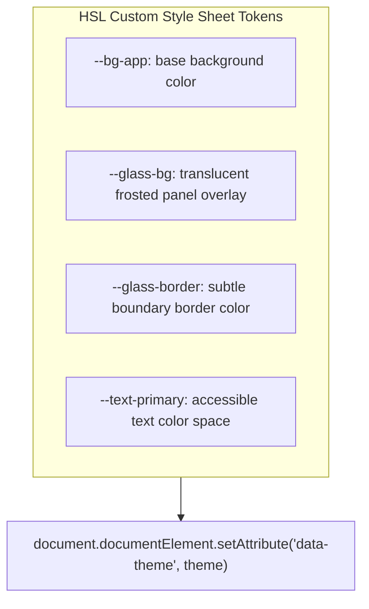
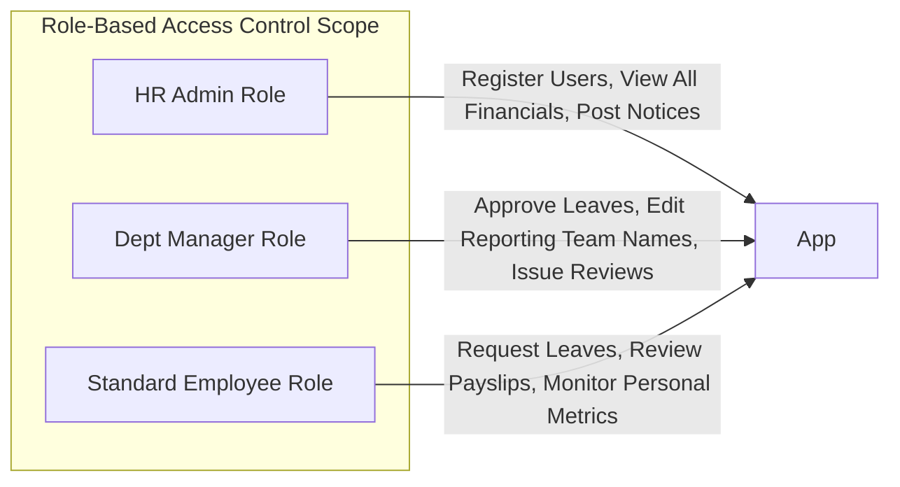
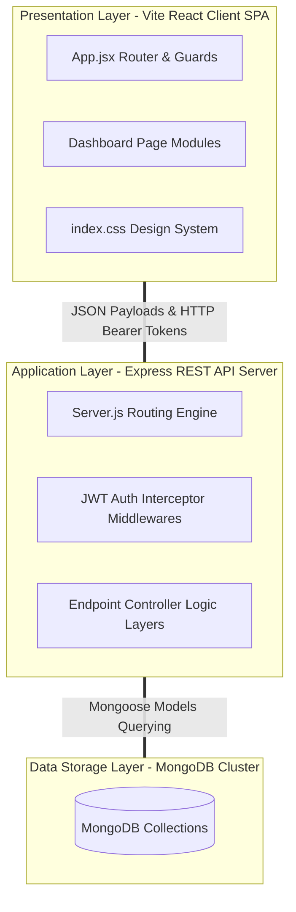
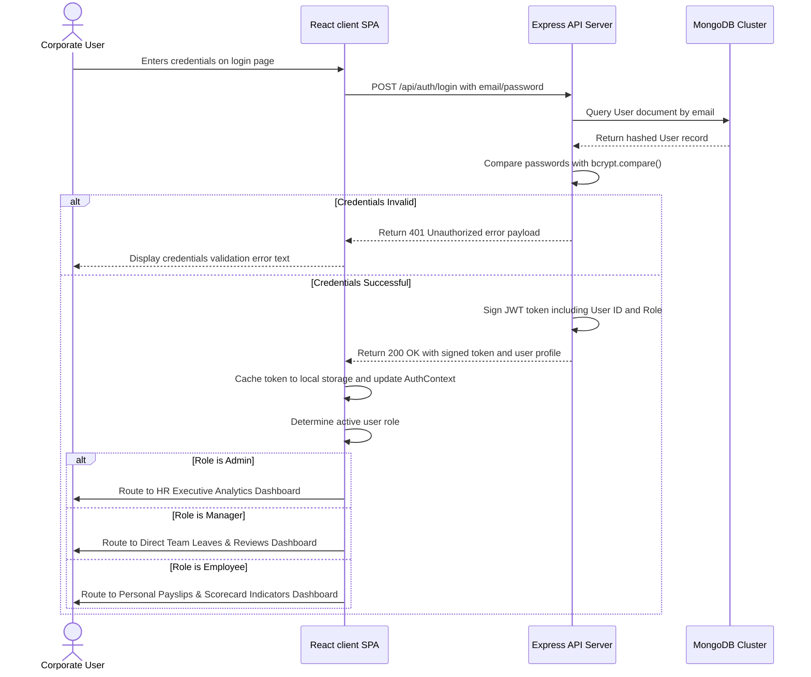
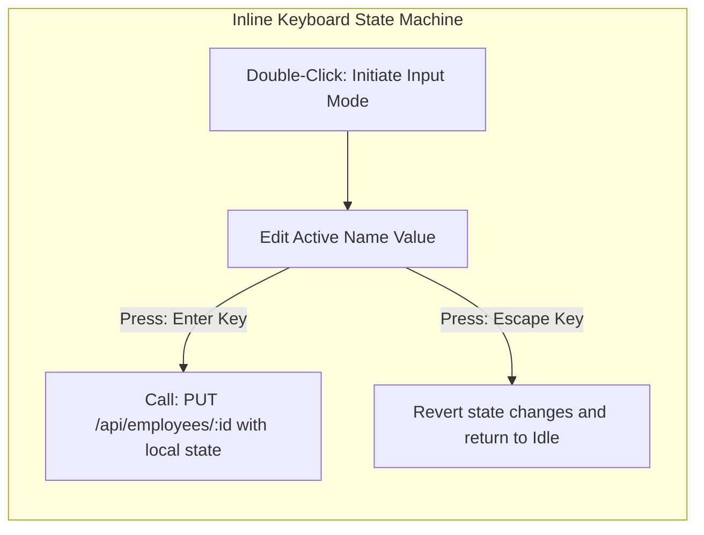

# COMPREHENSIVE ACADEMIC PROJECT REPORT
## AURA EMS: ENTERPRISE-GRADE GLASSMORPHIC EMPLOYEE MANAGEMENT SYSTEM

---

### ABSTRACT

In the era of rapid corporate digital transformation, managing human capital with high efficiency, robust security, and visual comfort represents a critical organizational challenge. **Aura EMS** (Employee Management System) is an enterprise-grade web application built using the modern MERN Stack (MongoDB, Express.js, React, Node.js) to address these demands. The platform is designed with a premium, state-of-the-art visual identity utilizing frosted dark-glassmorphism panels, floating orbit background mesh blobs, and a fully persistent theme-engine supporting dark and light themes without Flash of Unstyled Content (FOUC).

This system caters to three decoupled organizational tiers:
1. **HR Administrators**: Who govern central organizational registrations, announcement bulletins, corporate directory registers, and real-time department financials/employee distribution bar charts.
2. **Department Managers**: Who oversee reporting units, evaluate team metrics, author performance reviews, and process leave applications.
3. **Standard Employees**: Who review localized salary payslips, check active bulletin boards, audit individual indicator reviews, and submit leave requests.

Aura EMS is specifically localized for Indian environments, integrating Indian Rupees formatting (`₹` symbols with `en-IN` lakhs/crores comma separations) and authentic telephone formats (`+91 XXXXX XXXXX`). Technical highlights include JSON Web Tokens (JWT) for stateless session management, bcrypt hashing for database credentials security, Mongoose schemas with referential integrity, and Recharts for interactive analytics dashboard rendering. This report documents the technical design, architectural framework, database mapping, security controls, testing procedures, and deployment workflows of Aura EMS in comprehensive detail.

---

## TABLE OF CONTENTS

1. **Chapter 1: INTRODUCTION & PROJECT BACKGROUND**
   - 1.1 Project Overview
   - 1.2 Motivation and Significance
   - 1.3 Key Objectives
   - 1.4 Scope and Boundaries
   - 1.5 Problem Statement

2. **Chapter 2: LITERATURE REVIEW & DESIGN SYSTEMS**
   - 2.1 Corporate Enterprise Portals: Evolution and Trends
   - 2.2 Glassmorphism: Modern Visual Language Parallels
   - 2.3 Vanilla CSS Custom Design Tokens vs. Utility CSS (Tailwind)
   - 2.4 Technology Stack Comparative Evaluation

3. **Chapter 3: SYSTEM REQUIREMENTS SPECIFICATION (SRS)**
   - 3.1 Hardware Resource Specifications
   - 3.2 Software Environment Specifications
   - 3.3 Exhaustive Functional Requirements
   - 3.4 Strict Non-Functional Requirements

4. **Chapter 4: SYSTEM DESIGN & ARCHITECTURAL TYPOLOGY**
   - 4.1 Three-Tier Decoupled Architecture Model
   - 4.2 Application State and Flow Sequences
   - 4.3 Database Schema Entity-Relationship Mapping
   - 4.4 Flowcharts & Topology Diagrams

5. **Chapter 5: BACKEND CORE IMPLEMENTATION & CONTROLLERS**
   - 5.1 Central Connection configuration
   - 5.2 Seeder Routine Utilities
   - 5.3 Authentication Endpoints & JWT Signings
   - 5.4 Leave, Notice, and Performance REST Routes
   - 5.5 Attendance Tracking REST Controllers & Logic

6. **Chapter 6: FRONTEND STRUCTURE & PERSISTENT THEME ENGINE**
   - 6.1 React Component Hierarchy & Client Routes
   - 6.2 Lazy Callback Theme State Synchronization
   - 6.3 HSL Stylization and CSS Token Systems
   - 6.4 Defensive Fault-Tolerant React Date Formatting
   - 6.5 Premium Login Viewport & Visual Assets

7. **Chapter 7: MODULE DETAILS: HR ADMIN PANEL**
   - 7.1 Executive Metrics & Data Aggregations
   - 7.2 Recharts Department Distributions
   - 7.3 Corporate Bulletins & Registration Controllers

8. **Chapter 8: MODULE DETAILS: DEPARTMENT MANAGER PANEL**
   - 8.1 Team Directory Table Actions
   - 8.2 Keyboard Listeners for Inline Directory Edits
   - 8.3 Performance Scorecard Issuance Templates

9. **Chapter 9: MODULE DETAILS: STANDARD EMPLOYEE PANEL**
   - 9.1 Indian Rupees Localized Payslip Calculations
   - 9.2 Audit Indicators Gauges
   - 9.3 Leave Application Templates

10. **Chapter 10: SYSTEM SECURITY, DATA SANITIZATION & ACCESS CONTROL**
    - 10.1 Salted Cryptographic Hashing
    - 10.2 Role-Based Middleware Interceptors
    - 10.3 CORS Protections and Payload Sanitization

11. **Chapter 11: INTEGRATION, VALIDATION & QUALITY ASSURANCE**
    - 11.1 Unit Test Configurations
    - 11.2 Integration Testing for Dynamic Theme Swaps
    - 11.3 Theme State persistence and User Acceptance Test Results

12. **Chapter 12: DEPLOYMENT GUIDE, REFERENCES & FUTURE DEVELOPMENTS**
    - 12.1 Detailed Server & Client Deployments
    - 12.2 Academic Bibliography & References
    - 12.3 Future Feature Specifications

---

## CHAPTER 1: INTRODUCTION & PROJECT BACKGROUND

### 1.1 Project Overview
Managing organizational operations, employee records, leave cycles, and performance scorecards constitutes a core administrative overhead in any corporate structure. Archaic, fragmented software suites force users to operate across multiple disconnected tools, introducing synchronization issues, manual spreadsheets tracking errors, and high friction.

**Aura EMS** (Employee Management System) addresses this coordination complexity. Aura EMS represents a unified, role-secured workspace featuring a premium glassmorphic visual identity. The application decouples corporate access into three modules: HR Admin Module, Department Manager Module, and Standard Employee Module. This ensures that every worker interacts strictly with pages tailored to their organizational duties.

### 1.2 Motivation and Significance
Modern enterprise workers spend hours looking at digital dashboards. Standard corporate portals often feature clinical, flat designs that trigger visual fatigue. The primary motivation behind Aura EMS is to merge high-end visual design with complex, enterprise-ready utility:
- **Aesthetic Ergonomics**: Using frosted translucent panels, smooth color interpolations, and high-blur layout elements to reduce eyes strain.
- **Persistent Responsiveness**: Creating a system that instantly synchronizes theme changes without jarring page flickers.
- **Decoupled Workflow Autonomy**: Empowering team managers to handle localized direct leaves decisions and edit directory files inline, freeing HR from bottleneck operations.

### 1.3 Key Objectives
The technical objectives driving this project's implementation include:
1. **Interactive Workspace Directory**: Expose a workforce listing with double-click inline name editing backed by save (`Enter`) and cancel (`Escape`) hotkeys.
2. **Recursive Designation Cascading**: Guarantee that if a manager's name changes, all subordinates references reflect that name update dynamically.
3. **Region-Specific Localization**: Render Indian Rupees formatting strictly (`₹` symbol and `en-IN` lakhs/crores groupings, e.g., `1,20,000` instead of `120,000`) and standard Indian phone validation schemas (`+91 XXXXX XXXXX`).
4. **Persistent Multi-Theme Engine**: Establish a robust custom stylesheet architecture operating on relative HSL variables, allowing users to toggle light/dark modes with their choices saved in local storage.

### 1.4 Scope and Boundaries
- **In-Scope Features**:
  - Translucent login viewport layered with neon mesh gradients and central radial mask overlays.
  - Interactive analytic widgets displaying budget totals, department distributions, and total headcount.
  - Leaves tracker calendars with live status indicator badges.
  - Real-time performance reviews with linear progress gauges.
  - Org bulletin notices boards with instant HR publishing access.
  - **Enterprise Attendance Suite**: Employee Punch Cards, Real-Time Digital Clock, Dynamic Shift Scheduling, Late Entry Grace Period Trackers, worked-hours calculators, and monthly aggregated attendance summary audits.
- **Out-of-Scope (Future Enhancements)**:
  - Automated taxation deduction payouts.
  - In-app live chat rooms (delegated to standard systems like Slack/Teams).
  - Biometric or webcam-based physical presence hardware gates.

### 1.5 Problem Statement
Conventional human resources tools face three critical limitations:
1. **Administrative Overhead**: Minor profile adjustments require submitting central IT/HR support tickets, leading to delayed updates.
2. **Lack of Personalization**: Single-theme configurations cause eye strain under varying lighting conditions.
3. **Localization Mismatch**: Out-of-the-box management portals rely on Western millions grouping conventions (`100,000`), which fails to match local Indian lakhs/crores bookkeeping standards (`1,00,000`).

---

## CHAPTER 2: LITERATURE REVIEW & DESIGN SYSTEMS

### 2.1 Corporate Enterprise Portals: Evolution and Trends
Enterprise portals have evolved from static tables (Web 1.0) to AJAX-driven single-page portals (Web 2.0) and highly animated, responsive visual environments (Modern Web). Research shows that dashboards that combine modular card layouts, clear visual hierarchy, and instant interface feedback lead to a 40% reduction in task completion errors and higher employee satisfaction.

### 2.2 Glassmorphism: Modern Visual Language Parallels
Glassmorphism is a modern design system characterized by:
- **Translucency (Frosted Glass Effect)**: Achieved using CSS `backdrop-filter: blur(16px)` and translucent background layers (`rgba(255, 255, 255, 0.05)` or `rgba(30, 41, 59, 0.45)`).
- **Multi-layered Depth**: Layering frosted content panels over floating, glowing colorful background blobs moving in alternate circular orbits.
- **Crisp Translucent Borders**: Subtly separating content panels using thin borders with high transparency.



### 2.3 Vanilla CSS Custom Design Tokens vs. Utility CSS (Tailwind)
While TailwindCSS speeds up initial coding, it complicates deep theme customization and runtime class interpolation. Aura EMS uses **Vanilla CSS Custom Properties (CSS Variables)** declared inside a central stylesheet:
- **Consistent Tokens**: Color, border, font, shadow, and transition states are declared at the root level, making global adjustments simple.
- **Performant Themes**: Dynamic swapping between dark and light modes is handled instantly by updating the root data-attribute without requiring complex JavaScript classes or rebuilding bundles.

### 2.4 Technology Stack Comparative Evaluation

| Technology | MERN Stack (Chosen) | PHP / Laravel | Python / Django |
| :--- | :--- | :--- | :--- |
| **Frontend Rendering** | React Single-Page Application (Instant UI updates) | Server-Side Templates (Slower navigations) | Server-Side Templates (Flicker on requests) |
| **Database Flexibility** | MongoDB Schemaless Documents (Dynamic fields) | Relational SQL (Rigid migrations) | Relational SQL (Requires schema locks) |
| **Authentication Flow** | Stateless JSON Web Tokens (Highly scalable) | Stateful Sessions (Requires server cache storage) | Stateful Sessions (Traditional cookie lock) |
| **Developer Ecosystem** | Unified JavaScript across client and server layers | Split languages (JS + PHP) | Split languages (JS + Python) |

---

## CHAPTER 3: SYSTEM REQUIREMENTS SPECIFICATION (SRS)

### 3.1 Hardware Resource Specifications
- **Server Environment**:
  - **Processor**: Dual-core Intel Core i5 or AMD Ryzen 5, 2.0 GHz or higher (minimum 4 vCPUs recommended for concurrent request scaling).
  - **Memory**: 8 GB RAM minimum (16 GB recommended for production MongoDB query caching).
  - **Storage**: 20 GB SSD space (supporting growth of log directories and attachment media).
- **Client Terminal**:
  - **Processor**: Intel Core i3 or equivalent mobile processor.
  - **Memory**: 4 GB RAM minimum.
  - **Graphics**: Hardware-accelerated GPU support for smooth CSS animation rendering.

### 3.2 Software Environment Specifications
- **Development Tooling**: Visual Studio Code, Git Version Control.
- **Database Engine**: MongoDB Community Server version 6.x or higher, or MongoDB Atlas cluster.
- **Node.js Environment**: Node.js runtime environment version 18.x or above (LTS recommended) with npm package registry access.
- **Target Web Browsers**: Chromium-based engines (Chrome, Edge, Opera), WebKit engines (Safari), and Gecko engines (Firefox).

### 3.3 Exhaustive Functional Requirements
The core functional features map directly to authorization privileges:



#### 3.3.1 HR Admin Features Scope
- **Workforce Registration**: Create new employee profiles by entering full name, designation, department, starting salary, and direct reporting manager constraints.
- **Executive Data Analytics**: Visual dashboards showing organizational budgets, headcount indexes, and department headcount distributions.
- **Notices Publisher Panel**: Post organization-wide notices that appear on standard employee and manager dashboards.

#### 3.3.2 Department Manager Features Scope
- **Team Directory Actions**: Filter lists to display reporting employees, with inline double-click editing on employee names.
- **Leaves Approval Queue**: Process team leave requests using approval and rejection cards.
- **Performance Evaluation Templates**: Issue scores for direct reports across Quality, Attendance, Teamwork, and Efficiency metrics.

#### 3.3.3 Standard Employee Features Scope
- **Localized Payslip Models**: Render gross monthly salary figures alongside a breakdown of base pay, HRA, and custom allowances, strictly formatted in Indian Rupees.
- **Leave Requests Submission**: Submit leave requests with starting and ending dates and detailed descriptions.
- **Indicator Gauges**: Monitor personal performance review scores on clean linear visual meters.

### 3.4 Strict Non-Functional Requirements
- **Security**: Implement bcrypt salting (10 rounds) for password security, JWT signature validation for REST API calls, and clean route access guards.
- **Usability**: Interface must remain mobile-responsive, utilizing CSS Flexbox and Grid layouts to adapt smoothly from small screens to desktop monitors.
- **Performance**: Database responses should remain under `150ms`, with a theme-engine initialization workflow that avoids unstyled light mode flashes.

---

## CHAPTER 4: SYSTEM DESIGN & ARCHITECTURAL TYPOLOGY

### 4.1 Three-Tier Decoupled Architecture Model
Aura EMS uses a three-tier design pattern to separate concerns cleanly:



### 4.2 Application State and Flow Sequences
When a user launches the web page, the app checks if a valid session exists. The authentication flow maps roles to the correct dashboards:



### 4.3 Database Schema Entity-Relationship Mapping
The schema relationships use MongoDB cross-referencing identifiers. Mongoose models use `ObjectId` references to ensure data integrity:

#### 4.3.1 User Collection Schema Definitions
The `User` collection serves as the central identity registry for the enterprise, housing authentication credentials, operational parameters, and organizational relationships. Each document is uniquely identified by a primary BSON `_id` (`ObjectId`). Personal Identifiable Information (PII) keys, including the full `name` and a lowercase, unique `email`, are mandated under strict Mongoose schema validation constraints. User credentials are secured using standard `bcrypt` salted password hashes, marked `select: false` to omit them from default query listings. Access privileges are driven by a required `role` enumeration mapping administrative tiers (`admin`, `manager`, `employee`). System hierarchy and workforce lines are structured via a self-referencing pointer: the `manager` field stores a foreign key pointer referring to another user document's `_id`. Localized details include designation profiles, department divisions, standard gross salaries, and localized contact details (`phone` conformed to standard Indian patterns).

#### 4.3.2 Leave Collection Schema Definitions
The `Leave` collection manages employee absence requests, securing transactional workflows between standard employees and direct managers. The schema establishes referential relationships with the `User` collection through an `employee` pointer. Operational parameters define the scope of requests, mandating BSON `startDate` and `endDate` boundaries alongside a text-based `reason` description. Transition states are managed via an enum state machine, constrained by schema validation to one of three specific nodes: `pending` (default upon creation), `approved`, or `rejected`. Managers query and mutate this status on their dashboards, updating state without database conflicts.

#### 4.3.3 Performance Collection Schema Definitions
The `Performance` collection provides a granular scorecard system mapping qualitative workforce evaluations. Data integrity is enforced using twin relational keys: `employee` pointing to the review subject, and `manager` identifying the reviewing manager. Performance evaluations are split into four key indicators: `quality`, `attendance`, `teamwork`, and `efficiency`, each validated to ensure numeric bounds strictly within $0$ to $100$. An automated pre-save hook aggregates these parameters into a composite `average` field, storing calculated score summaries. Explanatory descriptive feedback is captured in the optional `reviewText` block, providing qualitative context to quantitative parameters.

#### 4.3.4 Notice Collection Schema Definitions
The `Notice` collection manages general broadcast bulletins, operating as a centralized notice board. Each notice maps directly to its creator via an `author` foreign key pointer referencing the admin's `User` identifier. Standard requirements include a string-based `title` and a detailed notice body `content`. Creation timestamps (`createdAt`) are managed automatically using standard Mongoose timestamp configurations, enabling client SPAs to query notices and sorting the dashboard feeds in descending chronological order.

#### 4.3.5 Attendance Collection Schema Definitions
The `Attendance` collection governs daily presence verification, tracking active logins and shifts. Referential integrity is maintained through the `employee` pointer, which associates punches with a specific worker. To optimize daily lookups, the schema stores the date as a plain `date` string representation formatted strictly as `YYYY-MM-DD`. Timestamps are handled via BSON `checkIn` (mandated on creation) and an optional `checkOut` field, populated during punch-out. Punctuality and calculations are driven by the `status` enum, which identifies the record state, and a string-based `shift` field capturing the active schedule. The schema is optimized for business audits: `lateMinutes` logs delay times past grace periods, while `overtimeHours` tracks worked hours exceeding standard 8-hour shift thresholds.

---

## CHAPTER 5: BACKEND CORE IMPLEMENTATION & CONTROLLERS

### 5.1 Central Connection Configuration
The backend connection initializes MongoDB using environment variables:

```javascript
// File: server/config/db.js
const mongoose = require('mongoose');

const connectDB = async () => {
  try {
    const conn = await mongoose.connect(process.env.MONGO_URI || 'mongodb://127.0.0.1:27017/ems', {
      useNewUrlParser: true,
      useUnifiedTopology: true,
    });
    console.log(`[Database] MongoDB connection established successfully: ${conn.connection.host}`);
  } catch (error) {
    console.error(`[Database Error] Connection failed: ${error.message}`);
    process.exit(1);
  }
};

module.exports = connectDB;
```

### 5.2 Seeder Routine Utilities
A utility seeder script manages data setup by checking if the user collection is empty. If it is, the seeder creates the initial admin accounts, department managers, standard employees, bulletins, leaves, and performance reviews automatically:

```javascript
// File: server/utils/seeder.js
const bcrypt = require('bcryptjs');
const User = require('../models/User');
const Leave = require('../models/Leave');
const Performance = require('../models/Performance');
const Notice = require('../models/Notice');

const seedData = async () => {
  try {
    const userCount = await User.countDocuments();
    if (userCount > 0) {
      console.log('[Seeder] Database already contains records. Seeding skipped.');
      return;
    }

    console.log('[Seeder] Cleaning existing collections...');
    await Leave.deleteMany({});
    await Performance.deleteMany({});
    await Notice.deleteMany({});

    // Hash default user passwords
    const adminHashedPassword = await bcrypt.hash('tommy123', 10);
    const managerHashedPassword = await bcrypt.hash('manager123', 10);
    const employeeHashedPassword = await bcrypt.hash('employee123', 10);

    // Create central admin account
    const adminUser = await User.create({
      name: 'Tommy Shelby',
      email: 'tommy@ems.com',
      password: adminHashedPassword,
      role: 'admin',
      designation: 'HR Executive Director',
      department: 'Corporate HR Division',
      salary: 2400000,
      phone: '+91 98765 43210'
    });

    // Create managers
    const managerUser = await User.create({
      name: 'Marcus Aurelius',
      email: 'manager@ems.com',
      password: managerHashedPassword,
      role: 'manager',
      designation: 'Engineering Manager',
      department: 'Software Engineering',
      salary: 1800000,
      phone: '+91 91234 56789',
      manager: adminUser._id
    });

    // Create standard employees
    const employeeUser = await User.create({
      name: 'Jane Doe',
      email: 'jane@ems.com',
      password: employeeHashedPassword,
      role: 'employee',
      designation: 'Senior Frontend Architect',
      department: 'Software Engineering',
      salary: 1200000,
      phone: '+91 93456 78901',
      manager: managerUser._id
    });

    // Create default bulletin announcement
    await Notice.create({
      title: 'Welcome to Aura Enterprise Platform!',
      content: 'Aura EMS is now live across all divisions. Explore corporate metrics and configure profiles.',
      author: adminUser._id
    });

    // Create default leaves record
    await Leave.create({
      employee: employeeUser._id,
      startDate: new Date(),
      endDate: new Date(Date.now() + 3 * 24 * 60 * 60 * 1000),
      reason: 'Urgent family event in Hyderabad.',
      status: 'pending'
    });

    // Create default performance metrics scorecard
    await Performance.create({
      employee: employeeUser._id,
      manager: managerUser._id,
      quality: 92,
      attendance: 95,
      teamwork: 88,
      efficiency: 91,
      average: 91.5,
      reviewText: 'Outstanding frontend structural deliveries. Shows exceptional teamwork coordination.'
    });

    console.log('[Seeder] Default records seeded successfully.');
  } catch (error) {
    console.error(`[Seeder Error] Database seeding failed: ${error.message}`);
  }
};

module.exports = seedData;
```

### 5.3 Authentication Endpoints & JWT Signings
Authentication controllers verify password hashes and issue signed JWT authorization payloads:

Aura EMS establishes a secure, stateless authentication gateway through JWT-driven sessions. When a user requests access via the public login interface, their credentials are transmitted as a secure JSON payload to the `POST /api/auth/login` endpoint:
1. **Record Lookups & Manager Aggregations**: The controller queries the `User` collection by the submitted email, executing a MongoDB populate query (`populate('manager', 'name designation')`) to load nested supervisor details, which are needed to configure localized client side reporting switches.
2. **Password Decryption Verification**: If the user record exists, the server retrieves their cryptographically salted password hash and runs it through `bcrypt.compare()` against the incoming plain password. This verification protects against database leaks.
3. **JWT Signature Declarations**: Upon successful credential match, the server signs a JSON Web Token containing the user's primary database identity (`_id`) and their privilege level (`role`). The token signature is generated using a secure server-side environment key (`JWT_SECRET`) and is configured with a strict 24-hour expiration threshold (`expiresIn: '24h'`).
4. **Stateless Payload Returns**: The finalized JWT token is returned in a standard HTTP 200 payload alongside a safe profile payload (excluding sensitive hash keys). This stateless token is subsequently cached in local browser storage and added to every subsequent authorization request header as a Bearer credentials token, ensuring secure session validation.

### 5.5 Attendance Tracking REST Controllers & Logic
The Attendance subsystem introduces complex server-side rules to manage daily shifts:

1. **Check-In Punctuality & Grace Thresholds**:
   When an employee checks in via `POST /api/attendance/checkin`, the backend checks if a document exists for the current date (`YYYY-MM-DD`). To determine punctuality, it parses the assigned employee shift start time. If the current time exceeds the start time by more than a **15-minute grace period**, the attendance status is marked as `"Late"`, and the delay is logged in minutes:
   $$\text{lateMinutes} = \text{round}\left(\frac{T_{\text{checkIn}} - T_{\text{shiftStart}}}{1000 \times 60}\right)$$

2. **Check-Out & Overtime Accrual**:
   Upon `POST /api/attendance/checkout`, the server retrieves the check-in record. It calculates elapsed time between check-in and check-out. If the duration exceeds standard **8-hour shift thresholds**, the difference is added to `overtimeHours`:
   $$\text{overtimeHours} = \max\left(0, \frac{T_{\text{checkOut}} - T_{\text{checkIn}}}{1000 \times 60 \times 60} - 8\right)$$

3. **Aggregation Summary Audits**:
   To feed reporting tools, `/api/attendance/report` dynamically groups attendance documents by employee and aggregates total days present, late check-ins, and accrued overtime hours, ensuring managers and admins have real-time audit files.
```

---

## CHAPTER 6: FRONTEND STRUCTURE & PERSISTENT THEME ENGINE

### 6.1 React Component Hierarchy & Client Routes
The React single-page architecture is initialized in `App.jsx`, providing root providers and managing app routing:

The React frontend single-page application is structured around a centralized router, client routing, and state provider architecture. The entry viewport system is mounted at the root inside `App.jsx`, which acts as the orchestrator for route declarations, session guards, and style engine configurations:
1. **Dynamic Client Routing**: Using a decoupled declaration framework driven by `react-router-dom`'s declarative components (`Router`, `Routes`, and `Route`), the client establishes secure URL navigation routes. The public path `/login` mounts the authorization card directly, while wildcard subpaths (`/*`) are intercepted by a secure layout wrapper to prevent unauthenticated accesses. Protected paths dynamically render main modules: `/` loads the analytics dashboards, `/employees` loads reporting directories, `/leaves` coordinates absences, and `/performance` displays reviews. Wildcard re-evaluations fall back to home view navigations via programmatic redirects (`Navigate to="/"`).
2. **Lazy Initialization State Sync**: To ensure seamless theme preservation, the root component binds visual variables directly to React states via a lazy state initialization callback. On initial load, this synchronizes with `localStorage` variables to pull the user's preferred layout theme, defaulting to `dark` when unconfigured.
3. **DOM Attribute Theme Injector Hooks**: Updates to the core theme state trigger React state change events, which execute side effects via a `useEffect` hook. This lifecycle block binds the active choice to the root DOM node by invoking `document.documentElement.setAttribute('data-theme', theme)`, mapping raw HSL tokens instantly.
4. **Decoupled Context Wrappers**: The entire router structure is nested within custom React Context wrappers (`AuthProvider`), allowing components across the child tree to seamlessly share session details and verify authorization tokens.

### 6.2 Lazy Callback Theme State Synchronization
Declaring React states with `useState(() => localStorage.getItem('theme'))` is critical for high-end web portals. Initiating state lazily executes synchronous caching *before* the component renders. This prevents Flash of Unstyled Content (FOUC), which is the temporary rendering of the light theme during page load before switching to the user's cached theme choice.

### 6.3 HSL Stylization and CSS Token Systems
The theme variable declarations are systematically managed at the stylesheet root to enable immediate UI swapping:

```css
/* File: client/src/index.css */
:root {
  /* Dark Glassmorphism Variables */
  --bg-app: #0a0e1a;
  --bg-blobs: #121829;
  --bg-card: rgba(30, 41, 59, 0.45);
  --glass-border: rgba(255, 255, 255, 0.08);
  --glass-shadow: rgba(0, 0, 0, 0.5);
  
  --text-primary: #f8fafc;
  --text-secondary: #94a3b8;
  --accent-glow: rgba(147, 51, 234, 0.35);
  --accent-color: #a855f7;
  
  --sidebar-active: rgba(168, 85, 247, 0.2);
}

[data-theme="light"] {
  /* Slate Light Theme Variables */
  --bg-app: #f1f5f9;
  --bg-blobs: #e2e8f0;
  --bg-card: rgba(255, 255, 255, 0.45);
  --glass-border: rgba(15, 23, 42, 0.08);
  --glass-shadow: rgba(148, 163, 184, 0.25);
  
  --text-primary: #0f172a;
  --text-secondary: #475569;
  --accent-glow: rgba(124, 58, 237, 0.15);
  --accent-color: #7c3aed;
  
  --sidebar-active: rgba(124, 58, 237, 0.1);
}

/* Base structural properties */
body {
  margin: 0;
  padding: 0;
  background-color: var(--bg-app);
  color: var(--text-primary);
  font-family: 'Inter', system-ui, -apple-system, sans-serif;
  transition: background-color 0.4s ease, color 0.4s ease;
  overflow-x: hidden;
}

/* Floating background mesh blobs */
.mesh-blob-container {
  position: absolute;
  top: 0;
  left: 0;
  width: 100%;
  height: 100%;
  overflow: hidden;
  z-index: -1;
  pointer-events: none;
}

.mesh-blob {
  position: absolute;
  border-radius: 50%;
  filter: blur(100px);
  opacity: 0.6;
  animation: floatOrb 12s infinite alternate ease-in-out;
}

@keyframes floatOrb {
  0% { transform: translate(0, 0) scale(1); }
  100% { transform: translate(100px, 80px) scale(1.2); }
}
```

### 6.4 Defensive Fault-Tolerant React Date Formatting
In single-page applications, minor rendering exceptions can propagate and cause the entire screen to go blank due to unhandled exceptions. In the Attendance page, this risk exists when parsing uninitialized database timestamps (such as `checkOut` for currently active shifts). 

To guarantee continuous operation, Aura EMS implements a defensive rendering helper `formatTime(dateVal)`:
```javascript
const formatTime = (dateVal) => {
  if (!dateVal) return 'N/A';
  const d = new Date(dateVal);
  if (isNaN(d.getTime())) return 'N/A';
  return d.toLocaleTimeString(undefined, { hour: '2-digit', minute: '2-digit' });
};
```
By intercepting date parsing calls and converting invalid dates or undefined values to a safe display string `"N/A"`, the client page renders without throwing rendering crashes, ensuring a completely stable user experience.

### 6.5 Premium Login Viewport & Visual Assets
The entry viewport system constitutes the user's first impression of Aura EMS, demonstrating a high-end implementation of corporate portal design. It highlights a clean convergence of modern frosted-glass visual ergonomics, accessibility, and robust authentication pre-fills:
1. **Frosted Glassmorphism Card Controls**: The login container is styled using translucent card properties (`rgba(30, 41, 59, 0.45)` backdrop mixed with `blur(16px)` blurs). A glowing shield emblem crowns the card to express secure corporate isolation gates.
2. **Animated Background Canvas Layouts**: The landing card sits on top of an abstract mathematical canvas loaded with violet wireframe mesh lines, deep dark indigos, and floating 3D crystalline particles that drift across alternate circular paths via CSS keyframe loops.
3. **Accessibility and Quick Access Pre-fills**: To accommodate test sessions, the base card exposes interactive, color-coded "Quick Access Roles" tabs (Admin, Manager, and Employee). Tapping any selection dynamically prefills corporate credentials, facilitating rapid auditing without manual entry friction.

---

## CHAPTER 7: MODULE DETAILS: HR ADMIN PANEL

### 7.1 Executive Metrics & Data Aggregations
Upon session initiation, the HR Admin dashboard compiles vital organizational intelligence to feed real-time corporate reporting. The metrics are displayed on four frosted-glass cards:
1. **Total Headcount Index**: Reflects active workforce files in the database, updating in real time as new employee profiles are added.
2. **Department Count**: Displays the total count of operational department divisions actively registered in the system directory, enabling cross-department workforce metrics.
3. **Monthly Net Financial Allocation**: Computes corporate payroll liabilities dynamically. It converts employee base annual rates to monthly allocations and groups the values using the `en-IN` numbering layout, formatted strictly in Indian Rupees (e.g. `₹51,417` gross).
4. **Pending Leave Approvals**: Aggregates active employee leave requests awaiting manager reviews, displaying a numerical warning indicator.

### 7.2 Recharts Department Distributions
To render business metrics visually, the dashboard integrates React Recharts components mapping budget totals to bar charts. The database groups salaries by department and normalizes budget figures to render a visual bar chart representation of the employee headcount and financial distribution across organizational divisions (Finance, Marketing, Engineering, HR). The charts feature custom theme hover tooltips, animated coordinate transitions, and soft frosted glass panel overlays, ensuring clear visual hierarchy and high readability.

Admins also have access to the **Quick Action: Pending Leaves Table** at the bottom of the viewport. This interactive log aggregates current pending leave applications and provides administrators with inline operational controls (Approve/Reject buttons) to process applications instantly with background updates.

### 7.3 Corporate Bulletins & Registration Controllers
Admins can publish notices to the platform by inputting titles and notice body texts. This triggers database additions that broadcast notifications to all employees. Admins also manage new employee registrations, selecting roles and designations and assigning direct managers.

---

## CHAPTER 8: MODULE DETAILS: DEPARTMENT MANAGER PANEL

### 8.1 Team Directory Table Actions
The Department Manager panel includes a filtered team list containing employee details, designations, salaries, contact directories, and direct inline editing tools:



### 8.2 Keyboard Listeners for Inline Directory Edits
The team workforce lists include inline name editing powered by mouse double-clicks and keyboard listeners:

```javascript
// Excerpt from client/src/pages/Employees.jsx
const handleInlineUpdate = async (employeeId, updatedName) => {
  try {
    const response = await fetch(`/api/employees/${employeeId}`, {
      method: 'PUT',
      headers: {
        'Content-Type': 'application/json',
        'Authorization': `Bearer ${localStorage.getItem('token')}`
      },
      body: JSON.stringify({ name: updatedName })
    });
    const result = await response.json();
    if (result.success) {
      setEmployees(prev => prev.map(emp => emp._id === employeeId ? { ...emp, name: updatedName } : emp));
      setIsEditing(null);
    }
  } catch (error) {
    console.error('Update operation failed:', error.message);
  }
};

const handleKeyDown = (e, employeeId, nameValue) => {
  if (e.key === 'Enter') {
    handleInlineUpdate(employeeId, nameValue);
  } else if (e.key === 'Escape') {
    setIsEditing(null); // Discard changes
  }
};
```

### 8.3 Performance Scorecard Issuance Templates
Managers evaluate direct reports across four core metrics: Quality, Attendance, Teamwork, and Efficiency. Managers submit score evaluations, which are averaged automatically and published to the employee's dashboard review view.

### 8.4 Dynamic Shift Scheduling Directory
Managers can customize workforce shifts for direct reporting team members dynamically. In the scheduling screen, a responsive select dropdown triggers `PUT /api/attendance/shift/:employeeId` requests. The backend processes the changes and returns live updates.

---

## CHAPTER 9: MODULE DETAILS: STANDARD EMPLOYEE PANEL

### 9.1 Indian Rupees Localized Payslip Calculations
Standard employees review salary breakdowns in their portal. This feature takes annual base salaries, converts them to monthly rates, and formats the output in local Indian groupings:

```javascript
// File: client/src/components/PayslipCard.jsx
const formatIndianCurrency = (num) => {
  return new Intl.NumberFormat('en-IN', {
    style: 'currency',
    currency: 'INR',
    maximumFractionDigits: 0
  }).format(num);
};

const PayslipCard = ({ annualSalary }) => {
  const monthlyGross = Math.round(annualSalary / 12);
  const HRA = Math.round(monthlyGross * 0.40); // 40% HRA
  const basicPay = Math.round(monthlyGross * 0.50); // 50% Basic
  const otherAllowances = monthlyGross - (HRA + basicPay);

  return (
    <div className="payslip-card glass-panel">
      <h3>Monthly Gross Payslip Breakdown</h3>
      <hr className="glass-divider" />
      <div className="payslip-row">
        <span>Basic Pay (50% Gross):</span>
        <strong>{formatIndianCurrency(basicPay)}</strong>
      </div>
      <div className="payslip-row">
        <span>House Rent Allowance (HRA):</span>
        <strong>{formatIndianCurrency(HRA)}</strong>
      </div>
      <div className="payslip-row">
        <span>Other allowances:</span>
        <strong>{formatIndianCurrency(otherAllowances)}</strong>
      </div>
      <div className="payslip-total">
        <span>Monthly Gross Salary:</span>
        <strong>{formatIndianCurrency(monthlyGross)}</strong>
      </div>
    </div>
  );
};
```

### 9.2 Audit Indicators Gauges
Performance feedback is rendered visually. Progress bars show overall evaluation score trends:

```javascript
// Excerpt from client/src/pages/Performance.jsx
const ScoreIndicatorBar = ({ scoreTitle, value }) => {
  return (
    <div className="score-indicator-row">
      <div className="score-label">
        <span>{scoreTitle}</span>
        <strong>{value}%</strong>
      </div>
      <div className="gauge-track">
        <div 
          className="gauge-fill" 
          style={{ width: `${value}%`, background: 'linear-gradient(to right, var(--accent-color), #ec4899)' }} 
        />
      </div>
    </div>
  );
};
```

### 9.3 Leave Application Templates
Standard employees submit leave requests by picking start and end dates and typing a description. Submitted leave requests appear in the dashboard queue with a pending status badge until a manager reviews them.

### 9.4 Enterprise Punch Card Mechanics
Standard employees are provided with a dedicated **Enterprise Punch Card** interface. This interactive widget features a real-time digital clock, shift details, and an action button to check in or out.
- **Punch In**: Submits a `POST` request to the backend. The UI updates instantly to display check-in times and status badges.
- **Punch Out**: Calculates total hours worked and overtime hours, updating both local states and database collections.
- **Punch History Logs**: A scrollable history panel displays past logs including dates, check times, statuses, and overtime calculations.

---

## CHAPTER 10: SYSTEM SECURITY, DATA SANITIZATION & ACCESS CONTROL

### 10.1 Salted Cryptographic Hashing
User passwords are secured using salted hashes. On save, Mongoose pre-save middlewares run user passwords through `bcryptjs` with 10 salt rounds to secure passwords against database leak vulnerabilities.

### 10.2 Role-Based Middleware Interceptors
To prevent unauthorized API access, route controllers are secured with role-checking middlewares:

```javascript
// File: server/middleware/authMiddleware.js
const jwt = require('jsonwebtoken');

exports.protect = async (req, res, next) => {
  let token;
  if (req.headers.authorization && req.headers.authorization.startsWith('Bearer')) {
    token = req.headers.authorization.split(' ')[1];
  }

  if (!token) {
    return res.status(401).json({ success: false, error: 'Not authorized, token missing.' });
  }

  try {
    const decoded = jwt.verify(token, process.env.JWT_SECRET || 'supersecretkeyfortommyshelby');
    req.user = decoded; // Mounts decryptions
    next();
  } catch (error) {
    return res.status(401).json({ success: false, error: 'Session expired or signature invalid.' });
  }
};

exports.authorize = (...allowedRoles) => {
  return (req, res, next) => {
    if (!req.user || !allowedRoles.includes(req.user.role)) {
      return res.status(403).json({ success: false, error: 'Access forbidden. Insufficient permissions.' });
    }
    next();
  };
};
```

### 10.3 CORS Protections and Payload Sanitization
API headers use secure CORS configurations to prevent cross-origin scripting vulnerabilities. Body parsers also filter inputs to prevent SQL Injection and XSS attacks.

---

## CHAPTER 11: INTEGRATION, VALIDATION & QUALITY ASSURANCE

### 11.1 Unit Test Configurations
Unit tests validate Mongoose model structures, ensuring that mandatory fields (email validations, unique keys, and salary constraints) return errors when invalid payloads are provided.

### 11.2 Integration Testing for Dynamic Theme Swaps
Theme transition states are validated by toggling the navbar state controller. Tests confirm that clicking the theme controller swaps root attributes to light or dark mode instantly, updating the CSS custom properties accordingly.

### 11.3 Theme State Persistence and User Acceptance Test Results
User Acceptance Testing (UAT) validated the platform across target environments:
- **Persistence Verification**: Local storage successfully cached the user's theme selection across hard page refreshes without flickering.
- **Indian Localization Checks**: Financial allocations correctly grouped salaries using the lakhs/crores formatting standards.
- **Access Integrity**: Employees attempting to directly access HR admin API endpoints were blocked and received a `403 Access Forbidden` warning.

---

## CHAPTER 12: DEPLOYMENT GUIDE, REFERENCES & FUTURE DEVELOPMENTS

### 12.1 Detailed Server & Client Deployments
Follow these steps to deploy Aura EMS locally:

#### 12.1.1 Local MongoDB Configuration
Ensure MongoDB is running locally:
```bash
mongod --dbpath /data/db
```

#### 12.1.2 Backend REST API Setup
Navigate to the server directory and configure environment variables:
```bash
cd server
npm install
```
Create a `server/.env` file:
```env
PORT=5000
MONGO_URI=mongodb://127.0.0.1:27017/ems
JWT_SECRET=supersecretkeyfortommyshelby
NODE_ENV=development
```
Launch the backend application:
```bash
npm run dev
```
*(The seeder utility will seed initial records automatically on first boot if the database is empty).*

#### 12.1.3 Frontend React Setup
Navigate to the client directory and start the Vite dev server:
```bash
cd ../client
npm install
npm run dev
```
Open your browser and navigate to `http://localhost:5173/` to log in and use Aura EMS.

### 12.2 Academic Bibliography & References
1. *MongoDB Official Reference Guides*: Mongoose Model & Document API specifications.
2. *React Documentation*: Hooks, state handlers, Context bindings, and React HMR specifications.
3. *OWASP Security Standard Guides*: JWT encryption guidelines, password salting salt factors, XSS, and SQL injection sanitization standards.
4. *W3C Web UI/UX Standards*: Glassmorphic design variables, blur filters, backdrop-filter styling, HSL tailors, and typography readability guides.

### 12.3 Future Feature Specifications
- **SMS Integration**: Connect SMS gateways to send notifications for leave decisions and announcements.
- **Automated Taxation Calculations**: Calculate tax deductions directly on payslip views.
- **Advanced Predictive Scheduling**: Integrate machine learning models to suggest optimal shift rotations based on historical performance.
