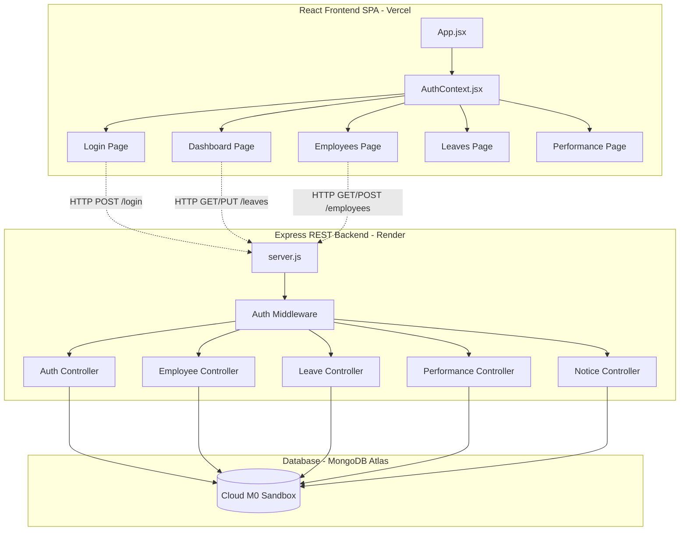

# Aura EMS: Elegant Glassmorphic MERN Employee Management Suite

Aura EMS is an enterprise-grade, state-of-the-art Employee Management System built using the **MERN** stack (MongoDB, Express, React, Node.js). It features a premium frosted glassmorphism interface, interactive analytics, and robust role-based privilege controls.

## 🚀 Live Demo

* **Frontend App**: [https://emp-plum.vercel.app](https://emp-plum.vercel.app)
* **Backend API**: [https://aura-ems-api.onrender.com](https://aura-ems-api.onrender.com)

---

## ✨ Features & Capabilities

### 1. High-Contrast Dual Theme System
* **Dark Mode (Default)**: Premium deep indigo HSL gradients with floating neon blobs and glowing frosted glass overlays.
* **Light Mode**: Fresh, high-contrast workspace featuring soft white translucent card sheets (`rgba(255,255,255,0.45)`), sleek slate-charcoal typography, and harmonious visual hierarchies for daytime work.
* **Persistent Engine**: Auto-cached client choices in `localStorage` with zero-flicker HTML root injection.

### 2. Enterprise Attendance Suite
* **Interactive Punch Cards**: Real-time clocks for employees with instantaneous, state-saved **Check-In** and **Check-Out** actions.
* **Shift Scheduling**: Live shift assignments (Morning, Evening, Night) persisted by managers on the fly.
* **Late-Arrival & Overtime Calculators**:
  * 15-minute grace-period validator marking check-ins past shift time as `Late`.
  * Automatic accrual of `overtimeHours` for worked durations exceeding standard 8-hour thresholds.
* **Monthly Aggregated Reports**: Comprehensive present count, late arrival totals, and overtime logs compiled for admins and managers.

### 3. Open Registration & Inline Name Editing
* **Open Employee Enrollment**: Accessible corporate signup page allowing any logged-in user to add new employees.
* **Inline Name Editing**: Double-click or pencil-trigger state-driven name editing within directory tables, automatically syncing downstream reports and managers.

### 4. Interactive Real-Time Notifications
* A sleek notifications tray inside the navigation bar that polls backend notice broadcasts every 30 seconds.
* Glowing pulse indicator badge showing unread notice counts, with smart read-receipt persistence.

---

## 🏗️ Architecture & Decoupled Privileges



---

## 🔑 Quick Access Demo Accounts
To facilitate rapid academic evaluation and test runs, the login screen includes quick prefill buttons:
* **Tommy Shelby (HR Admin)**: `tommy@ems.com` / `tommy123`
* **Marcus Aurelius (Eng Director / Manager)**: `manager@ems.com` / `manager123`
* **Jane Doe (Senior Frontend Architect / Employee)**: `jane@ems.com` / `employee123`

---

## 🎓 Academic Documentation
Comprehensive reports matching professional university publication standards are included in this repository:
1. **Academic Project Report**: [Aura_EMS_Comprehensive_Academic_Report.md](Aura_EMS_Comprehensive_Academic_Report.md) (Exhaustive 12-chapter textbook details, math models, schemas, and algorithms).
2. **Project Presentation Slide Deck**: [Aura_EMS_Project_Presentation.md](Aura_EMS_Project_Presentation.md) (Slide-by-slide layout with full speaker notes).

---

## 🛠️ Local Development Setup

### Prerequisites
* [Node.js](https://nodejs.org/) installed locally.
* A running [MongoDB](https://www.mongodb.com/try/download/community) instance (local or Atlas).

### 1. Setup Backend Server
```bash
cd server
npm install
```
Create a `.env` file inside `server/` with the following configuration:
```env
PORT=5000
MONGO_URI=mongodb://127.0.0.1:27017/employee_db
JWT_SECRET=your_secure_jwt_secret_key
```
Start the server in development mode:
```bash
npm run dev
```
*(The server seeds initial mock data automatically on first launch if the database is empty).*

### 2. Setup React Client
In a new terminal window:
```bash
cd client
npm install
```
Start the client server:
```bash
npm run dev
```
Open **`http://localhost:5173`** in your browser.

---

## ☁️ Free Cloud Deployment
For instructions on deploying this project completely for free on MongoDB Atlas, Render, and Vercel, refer to our detailed [Free Hosting Guide](free_hosting_guide.md).
